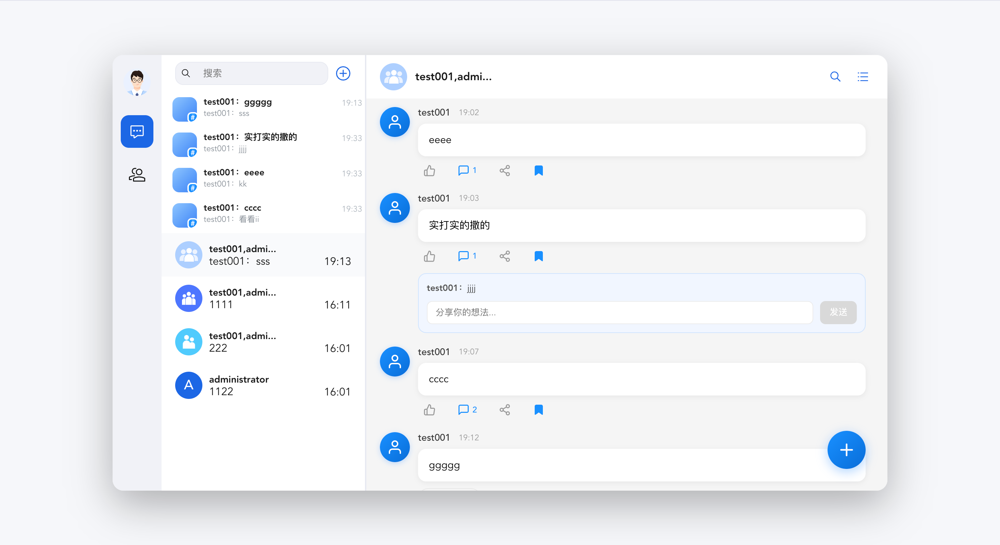

# Rsbuild project

## 页面样式参考

> 该截图展示了当前项目启动后打开页面的整体样式，可作为 UI 对照参考。



## Setup

Install the dependencies:

```bash
npm install
```

## Get started

Start the dev server, and the app will be available at [http://localhost:3000](http://localhost:3000).

```bash
npm run dev
```

Build the app for production:

```bash
npm run build
```

Preview the production build locally:

```bash
npm run preview
```

## Learn more

To learn more about Rsbuild, check out the following resources:

- [Rsbuild documentation](https://rsbuild.rs) - explore Rsbuild features and APIs.
- [Rsbuild GitHub repository](https://github.com/web-infra-dev/rsbuild) - your feedback and contributions are welcome!


# 前端技术总结文档

> 文档版本：1.0  
> 创建时间：2026-02-25  
> 用途：为后端开发提供前端技术架构和接口对接参考

---

## 一、项目概述

### 1.1 项目信息

| 项目 | 说明 |
|------|------|
| 项目名称 | chat-example |
| 项目类型 | React Web 聊天应用 |
| 构建工具 | Rsbuild (基于 Rspack) |
| 开发语言 | TypeScript + React 18 |
| UI 组件库 | Tencent Cloud Chat TUIKit React |
| 音视频组件 | Tencent Cloud TUICallKit React |

### 1.2 核心功能

- ✅ 会话列表管理（单聊/群聊）
- ✅ 聊天窗口（消息展示、消息输入）
- ✅ 联系人管理
- ✅ 聊天设置（置顶、免打扰、群管理）
- ✅ 会话内搜索（云端搜索）
- ✅ 音视频通话（语音/视频）
- ✅ 主题切换（亮色/暗色）
- ✅ 多语言支持（中文/英文/日文/韩文/繁体中文）
- ✅ **群组头像自动生成**（根据群类型自动区分）
- ✅ **社群专属聊天页面**（留言板式互动）
- ✅ **消息互动功能**（点赞、评论、转发、收藏）

---

## 二、技术架构

### 2.1 技术栈

```json
{
  "核心框架": "React 18.3.1",
  "构建工具": "Rsbuild 1.7.1",
  "语言": "TypeScript 5.9.3",
  "IM 组件": "@tencentcloud/chat-uikit-react 5.3.0",
  "音视频组件": "@trtc/calls-uikit-react 4.4.5"
}
```

### 2.2 目录结构

```
chat-example/
├── public/                 # 静态资源目录
│   └── favicon.png
├── src/
│   ├── api/                # API 接口层（待扩展）
│   ├── App.tsx             # 主应用组件
│   ├── App.css             # 应用样式
│   ├── index.tsx           # 应用入口
│   ├── env.d.ts            # TypeScript 环境声明
│   ├── components/         # 自定义组件目录
│   │   └── CommunityChatView.tsx   # 社群专属聊天页面组件
│   └── utils/              # 工具函数目录
│       └── groupAvatar.ts          # 群组头像生成工具
├── doc/                    # 文档目录
├── package.json            # 项目配置与依赖
├── rsbuild.config.ts       # Rsbuild 构建配置
├── tsconfig.json           # TypeScript 配置
└── key.yaml                # 测试凭证配置（仅开发环境）
```

### 2.3 构建配置

**rsbuild.config.ts**
```typescript
import { defineConfig } from '@rsbuild/core';
import { pluginReact } from '@rsbuild/plugin-react';

export default defineConfig({
  plugins: [pluginReact()],
});
```

**tsconfig.json 关键配置**
- 模块系统：ESNext
- 模块解析：bundler
- JSX：react-jsx
- 严格模式：开启
- 目标环境：ES2020

---

## 二.4 自定义功能模块

### 群组头像生成系统

**文件**: `src/utils/groupAvatar.ts`

**功能说明**:
- 基于 DiceBear 开源头像 API 生成群组头像
- 根据不同群类型自动匹配不同头像风格
- 支持个性化头像定制（通过种子参数）

**群类型与头像风格映射**:

| 群类型 | 类型标识 | 头像风格 | 说明 |
|--------|----------|----------|------|
| 好友工作群 | `Work` | `bottts` | 机器人风格，适合工作场景 |
| 陌生人社交群 | `Public` | `avataaars` | 人物头像风格，适合社交 |
| 临时会议群 | `Meeting` | `identicon` | 几何图形，简洁专业 |
| 直播群 | `AVChatRoom` | `pixel-art` | 像素风格，活泼有趣 |
| 社群 | `Community` | `shapes` | 多彩图形，开放包容 |

**核心 API**:
```typescript
// 根据群类型生成头像 URL
function generateGroupAvatarByType(
  groupName: string,
  groupType: GroupType
): string

// 通用头像生成（可自定义风格）
function generateGroupAvatar(
  seed: string,
  style?: AvatarStyle,
  options?: AvatarOptions
): string
```

### 社群专属聊天页面

**文件**: `src/components/CommunityChatView.tsx`

**功能特性**:
1. **留言板模式**: 用户点击右下角"+"按钮发布留言
2. **大浮窗输入**: 模态框式设计（600px 宽，80vh 高）
3. **消息互动**: 每条消息支持点赞、评论、转发、收藏
4. **独立视图**: 点击社群会话时自动切换到专属页面

**触发条件**:
- 当检测到群组类型为 `Community` 时自动启用
- 保留标准群聊的头部信息（群头像、群名称、右上角按钮）

**消息互动功能**:

| 功能 | 图标 | 交互说明 |
|------|------|----------|
| 点赞 | 👍 | 点击切换状态，显示点赞数，蓝色高亮 |
| 评论 | 💬 | 点击展开评论区（蓝色区域），支持输入并发送；列表态仅展示最近 2 条，超过 2 条显示“查看更早 x 条回复”，点击进入评论详情页 |
| 转发 | ↗️ | 点击弹出“转发”弹窗，在弹窗中从会话列表选择联系人/群组作为转发目标（支持搜索），选中即完成并关闭弹窗 |
| 收藏 | 📌 | 点击后将当前帖子加入“话题收藏”，左侧会话栏顶部出现一条话题入口（头像=社群头像叠加#）；再次点击取消收藏则移除话题入口 |

#### 评论交互细节（社群留言板）

社群页面的评论交互分为两种展示形态，用于兼顾信息密度与可读性。

1. **列表态（帖子下方展开）**
  - 用户点击帖子下方的“评论”按钮后：
    - 评论按钮变为蓝色高亮
    - 帖子下方出现蓝色评论区（包含评论预览与输入框）
  - 评论展示规则：
    - 默认只展示最近 2 条评论
    - 当评论数超过 2 条时，显示入口文案：`查看更早 x 条回复`
  - 输入与发送：
    - 用户在输入框输入内容后点击“发送”，评论会追加到该帖的评论列表，并立即在预览区可见

2. **详情态（评论详情面板）**
  - 用户点击 `查看更早 x 条回复` 后，会打开评论详情面板
  - 详情面板内容：
    - 顶部展示“原帖内容 + 互动信息（如点赞信息） + 完整评论列表”
    - 互动信息为可选区块：如果没有点赞等互动数据，则不展示该区域
    - 底部固定评论输入框，支持继续发表评论

#### 转发/分享交互细节（社群留言板）

社群页面的“转发”采用弹窗选择目标会话的方式，交互与主界面左侧会话列表一致：

1. **打开方式**
  - 用户点击帖子下方“转发”按钮后，弹出“转发”弹窗

2. **弹窗内容**
  - 顶部标题：`转发`
  - 搜索输入框：用于过滤目标会话（联系人/群组）
  - 会话列表：复用 TUIKit 的 `ConversationList` 展示最近会话

3. **选择目标**
  - 用户点击某个会话条目，即视为选择该联系人/群组作为转发目标
  - 选择后提示转发结果并关闭弹窗

#### 收藏=话题入口（社群留言板）

为了让用户快速回到已收藏的帖子评论区，收藏功能在 UI 上会同步生成一个“话题入口”，展示在左侧会话列表上方。

补充说明：话题入口与原会话条目处于同一层级（同一滚动列表内），视觉与交互一致。

1. **话题入口标题规则**
  - 话题入口名称不再使用社群名
  - 统一为：`发帖人：发帖内容（截断）`

2. **话题入口预览规则**
  - 会话预览文案显示为该帖**最后一条评论**
  - 如果没有评论，则显示 `暂无评论`

补充：话题入口右侧时间显示为该帖**最后一条评论的发布时间**；如果没有评论，则使用发帖时间作为兜底。

3. **话题入口头像规则**
  - 基于社群头像
  - 右下角叠加 `#` 标识，表示“话题群/话题入口”

4. **点击行为**
  - 点击话题入口后，直接打开该帖的评论详情面板（复用“查看更早 x 条回复”的详情态）

5. **多话题入口**
  - 支持收藏多个帖子，每个帖子对应一个话题入口
  - 去重规则：同一 `groupID + messageId` 只保留一条
  - 取消收藏：仅移除对应话题入口，不影响其他已收藏话题

---

## 三、核心组件说明

### 3.1 Chat TUIKit 组件

TUIKit 是基于腾讯云 Chat SDK 的 React UI 组件库，提供以下核心组件：

| 组件名 | 功能说明 | 是否必需 |
|--------|----------|----------|
| `UIKitProvider` | 全局提供者，配置主题和语言 | 必需 |
| `ConversationList` | 会话列表组件 | 可选 |
| `Chat` | 聊天容器组件 | 必需 |
| `ChatHeader` | 聊天头部组件 | 可选 |
| `MessageList` | 消息列表组件 | 必需 |
| `MessageInput` | 消息输入组件 | 必需 |
| `ContactList` | 联系人列表组件 | 可选 |
| `ContactInfo` | 联系人详情组件 | 可选 |
| `ChatSetting` | 聊天设置组件 | 可选 |
| `Search` | 云端搜索组件 | 可选 |
| `Avatar` | 头像组件 | 可选 |

### 3.2 TUICallKit 音视频组件

| API | 功能说明 |
|-----|----------|
| `TUICallKitAPI.init()` | 初始化音视频 SDK |
| `TUICallKitAPI.calls()` | 发起通话（单聊/群聊） |
| `CallMediaType.VIDEO` | 视频通话类型 |
| `CallMediaType.AUDIO` | 语音通话类型 |

### 3.3 组件使用示例

**基础聊天集成**
```tsx
import {
  UIKitProvider,
  useLoginState,
  LoginStatus,
  ConversationList,
  Chat,
  ChatHeader,
  MessageList,
  MessageInput,
} from "@tencentcloud/chat-uikit-react";

function App() {
  return (
    <UIKitProvider theme={'light'} language={'zh-CN'}>
      <ChatApp />
    </UIKitProvider>
  );
}

function ChatApp() {
  const { status } = useLoginState({
    SDKAppID: 1600127148,  // number 类型
    userID: 'test001',      // string 类型
    userSig: 'xxx',         // string 类型
  });

  if (status !== LoginStatus.SUCCESS) {
    return <div>登录中...</div>;
  }

  return (
    <Chat>
      <ChatHeader />
      <MessageList />
      <MessageInput />
    </Chat>
  );
}
```

**音视频通话集成**
```tsx
import { TUICallKit, TUICallKitAPI, CallMediaType } from "@trtc/calls-uikit-react";

// 组件挂载
<TUICallKit
  style={{ 
    position: 'fixed', 
    top: '50%', 
    left: '50%', 
    transform: 'translate(-50%, -50%)',
    zIndex: 1000
  }}
/>

// 发起通话
await TUICallKitAPI.calls({
  userIDList: [calleeUserID],
  type: CallMediaType.VIDEO,
});
```

---

## 四、自定义组件集成

### 4.1 社群页面检测逻辑

在 `App.tsx` 中通过自定义 `ConversationPreview` 组件实现社群类型检测：

```tsx
const CustomConversationPreview: React.FC<ConversationPreviewProps> = (props) => {
  const { conversation } = props;
  const groupProfile = (conversation as any)?.groupProfile;
  const isCommunity = groupProfile?.type === 'Community';

  return (
    <div
      onClick={() => {
        if (isCommunity) {
          // 切换到社群专属页面
          setCurrentCommunity({
            groupID: groupProfile.groupID,
            groupName: groupProfile.name || '社群',
          });
          setShowCommunityView(true);
        }
        setActiveConversation(conversation?.conversationID);
      }}
      style={{ cursor: 'pointer' }}
    >
      <ConversationPreview {...props} />
    </div>
  );
};
```

### 4.2 群组头像集成

在创建群组前拦截参数，自动添加头像 URL：

```tsx
onBeforeCreateConversation={(params) => {
  if (params && typeof params === 'object' && 'type' in params) {
    const createParams = params as any;
    if (createParams.type === 'GROUP' && createParams.name) {
      const groupType = (createParams.groupType as GroupType) || 'Public';
      const avatarUrl = generateGroupAvatarByType(createParams.name, groupType);
      return {
        ...createParams,
        faceUrl: avatarUrl,
      };
    }
  }
  return params;
}}
```

---

## 五、鉴权与登录

### 4.1 登录流程

```
1. 获取 SDKAppID（从腾讯云 IM 控制台）
2. 生成 userID（自定义用户标识）
3. 生成 userSig（用户签名，生产环境需后端生成）
4. 调用 useLoginState hook 完成登录
5. 监听 LoginStatus 状态变化
```

### 4.2 鉴权参数

| 参数 | 类型 | 说明 | 来源 |
|------|------|------|------|
| `SDKAppID` | Number | 应用唯一标识 | IM 控制台 |
| `userID` | String | 用户唯一标识 | 自定义 |
| `userSig` | String | 用户登录凭证 | 后端生成/控制台 |

### 4.3 后端对接要求

**生产环境必须实现以下接口：**

```
POST /api/auth/usersig
Request:
{
  "userID": "string",        // 用户唯一标识
  "expireTime": 604800       // 可选，有效期（秒），默认 7 天
}

Response:
{
  "code": 0,
  "message": "success",
  "data": {
    "userSig": "string",
    "expireTime": number,
    "sdkAppId": 1600127148,
    "userId": "string"
  }
}
```

**userSig 生成算法参考：**
- 使用官方 TLSSigAPIv2 Python 代码（来自腾讯云文档）
- 使用 HMAC-SHA256 签名
- 需要 SDKSecretKey（从 IM 控制台获取）
- 有效期建议设置为 7 天（604800 秒）

---

## 六、消息类型支持

### 5.1 基础消息类型

| 消息类型 | 说明 | 后端处理 |
|----------|------|----------|
| `TIMTextElem` | 文本消息 | 直接存储和转发 |
| `TIMFaceElem` | 表情消息 | 存储表情索引 |
| `TIMImageElem` | 图片消息 | 需要图床支持 |
| `TIMSoundElem` | 语音消息 | 需要语音存储和 CDN |
| `TIMVideoElem` | 视频消息 | 需要视频存储和 CDN |
| `TIMFileElem` | 文件消息 | 需要文件存储 |
| `TIMLocationElem` | 位置消息 | 存储经纬度 |
| `TIMCustomElem` | 自定义消息 | 业务自定义 |

### 5.2 群消息类型

| 消息类型 | 说明 |
|----------|------|
| `TIMGroupSystemNoticeElem` | 群系统通知 |
| `TIMGroupTipsElem` | 群提示消息（成员变更等） |

---

## 七、后端接口需求

### 6.1 用户相关接口

```
# 导入单个账号（用户创建）
POST /api/user/import
Request: { "userID": "string", "nickName": "string", "faceUrl": "string" }
Response: { "code": 0, "message": "success" }

# 获取用户信息
GET /api/user/info?userID={userID}
Response: { "code": 0, "data": { "userID": "string", "nickName": "string", "faceUrl": "string" } }

# 批量导入账号
POST /api/user/import/batch
Request: { "accounts": [{"userID": "string", "nickName": "string", "faceUrl": "string"}] }
Response: { "code": 0, "data": { "successCount": number, "failCount": number } }

# 删除账号
POST /api/user/delete
Request: { "userIDs": ["string"] }
Response: { "code": 0, "message": "success" }
```

### 6.2 会话相关接口

```
# 获取会话列表（可选，TUIKit 自动管理）
GET /api/conversation/list?userID={userID}&nextSeq={seq}

# 删除会话
POST /api/conversation/delete
Request: { "userID": "string", "conversationID": "string" }
```

### 6.3 群组相关接口

```
# 创建群组
POST /api/group/create
Request: { "groupID": "string"(可选), "name": "string", "type": "Public|Private|ChatRoom|AVChatRoom", "ownerID": "string", "members": ["string"], "notification": "string", "introduction": "string" }
Response: { "code": 0, "data": { "groupID": "string", "name": "string", "createTime": number } }

# 获取群信息
GET /api/group/info?groupID={groupID}
Response: { "code": 0, "data": { "groupID": "string", "name": "string", "type": "string", "ownerID": "string", "memberCount": number, "createTime": number } }

# 获取群成员列表
GET /api/group/members?groupID={groupID}&nextSeq={seq}
Response: { "code": 0, "data": { "members": [{"userID": "string", "nickName": "string", "role": "string"}], "nextSeq": number } }

# 添加群成员（邀请成员）
POST /api/group/member/add
Request: { "groupID": "string", "members": ["string"] }
Response: { "code": 0, "message": "success" }

# 删除群成员（踢出成员）
POST /api/group/member/delete
Request: { "groupID": "string", "members": ["string"] }
Response: { "code": 0, "message": "success" }
```

### 6.4 消息相关接口

```
# 发送消息（TUIKit 通过 SDK 直接发送，后端可选监听回调）
POST /api/message/send
Request: { "from": "string", "to": "string", "type": "string", "content": {} }

# 获取历史消息（可选，TUIKit 自动拉取）
GET /api/message/history?conversationID={id}&nextSeq={seq}&count={count}

# 消息撤回（通过 SDK 实现）
# 消息删除（通过 SDK 实现）
```

### 6.5 搜索相关接口（云端搜索插件）

```
# 全局搜索
GET /api/search?q={keyword}&type=group|user|message

# 会话内搜索
GET /api/search/conversation?conversationID={id}&q={keyword}
```

---

## 八、事件监听与回调

### 7.1 SDK 事件

TUIKit 底层基于腾讯云 IM SDK，支持以下事件监听：

```typescript
// 监听新消息
tim.on(TIM.EVENT.MESSAGE_RECEIVED, (event) => {
  console.log('收到新消息:', event.data);
});

// 监听会话更新
tim.on(TIM.EVENT.CONVERSATION_LIST_UPDATED, (event) => {
  console.log('会话列表更新:', event.data);
});

// 监听群组更新
tim.on(TIM.EVENT.GROUP_LIST_UPDATED, (event) => {
  console.log('群列表更新:', event.data);
});

// 监听用户状态更新
tim.on(TIM.EVENT.USER_STATUS_UPDATED, (event) => {
  console.log('用户状态更新:', event.data);
});
```

### 7.2 后端回调通知

建议后端实现以下 Webhook 回调：

```
# 消息发送回调
POST /webhook/message/sent

# 消息接收回调
POST /webhook/message/received

# 用户上线/下线回调
POST /webhook/user/status

# 群成员变更回调
POST /webhook/group/member_changed
```

---

## 九、样式与主题

### 8.1 主题变量

TUIKit 使用 CSS 变量实现主题切换：

```css
/* 亮色主题 */
--uikit-theme-light-bg-color-function: #f5f5f5;
--uikit-theme-light-text-color-primary: #000000;
--uikit-theme-light-stroke-color-primary: #e5e5e5;

/* 暗色主题 */
--uikit-theme-dark-bg-color-function: #1a1a1a;
--uikit-theme-dark-text-color-primary: #ffffff;
--uikit-theme-dark-stroke-color-primary: #333333;
```

### 8.2 自定义样式

可以通过 CSS 覆盖默认样式：

```css
/* 自定义聊天布局 */
.chat-layout {
  height: 80vh;
  border-radius: 16px;
  overflow: hidden;
}

/* 自定义侧边栏 */
.chat-sidebar {
  position: absolute;
  right: 0;
  min-width: 300px;
  max-width: 400px;
  z-index: 1000;
}
```

---

## 十、开发规范

### 9.1 代码规范

- 使用 TypeScript 严格模式
- 组件采用函数式组件 + Hooks
- 状态管理优先使用 React 内置 Hooks
- 复杂状态可使用 Zustand/Redux

### 9.2 提交规范

```
feat: 新功能
fix: 修复 bug
docs: 文档更新
style: 样式调整
refactor: 重构
test: 测试相关
chore: 构建/工具链
```

### 9.3 环境要求

| 环境 | 版本要求 |
|------|----------|
| Node.js | v18+ (推荐 v22 LTS) |
| npm | v9+ |
| React | 18.x (不支持 17.x/19.x) |
| TypeScript | ^5.0.0 |

---

## 十一、常见问题

### 10.1 登录失败

**可能原因：**
- SDKAppID 错误
- userID 格式不正确
- userSig 过期或错误
- userID 和 userSig 不匹配

**解决方案：**
- 检查控制台获取的 SDKAppID
- userID 只能包含字母、数字、下划线、连字符
- 重新生成 userSig
- 确保 userID 和 userSig 一一对应

### 10.2 消息发送失败

**可能原因：**
- 未登录成功
- 对方不存在或被拉黑
- 群已解散或无权限

**解决方案：**
- 检查 LoginStatus 状态
- 确认对方 userID 正确
- 检查群状态和权限

### 10.3 音视频通话失败

**可能原因：**
- 未安装 TUICallKit 依赖
- 未正确初始化
- 浏览器权限未授权

**解决方案：**
- 安装 `@trtc/calls-uikit-react`
- 调用 `TUICallKitAPI.init()`
- 授权摄像头和麦克风权限

### 10.4 会话列表摘要/时间显示规则（包含社群特殊逻辑）

为了避免“空会话也显示文案”的问题，会话列表条目的摘要与时间统一采用“只取最后一条消息”的策略：

1. **普通会话/群聊（非社群）**
  - 摘要：仅显示 SDK 提供的 `conversation.lastMessage.messageForShow`
  - 时间：仅显示 `conversation.lastMessage.lastTime` 对应时间
  - 如果 `lastMessage` 不存在，则摘要与时间都不显示

2. **社群会话（Community）**
  - 不使用 SDK 的 `lastMessage` 作为摘要来源
  - 摘要：显示“最后一条帖子 的 最后一条评论”（格式：`评论人：评论内容`）
  - 时间：显示该“最后一条评论”的发布时间（没有评论则使用发帖时间兜底）
  - 该摘要/时间由 `CommunityChatView` 在帖子/评论变化时上报给 `App`，用于渲染会话列表

---

## 十二、新增功能参考文档

### 12.1 DiceBear 头像 API

- **官方网站**: https://www.dicebear.com/
- **支持的头像风格**:
  - `avataaars`: 人物头像风格
  - `bottts`: 机器人风格
  - `identicon`: 几何图形
  - `pixel-art`: 像素艺术
  - `shapes`: 多彩图形

**API 格式**:
```
https://api.dicebear.com/9.x/{style}/svg?seed={seed}&backgroundColor={colors}
```

### 12.2 react-icons 图标库

- **官方网站**: https://react-icons.github.io/react-icons/
- **使用的图标系列**: Feather Icons (`fi`)
- **安装的图标**:
  - `FiThumbsUp`: 点赞
  - `FiMessageSquare`: 评论
  - `FiShare2`: 转发
  - `FiBookmark`: 收藏
  - `FiUser` / `FiUsers`: 用户头像
  - `FiArrowLeft`: 返回箭头
  - `FiX`: 关闭按钮
  - `FiPlus`: 添加按钮

---

## 十三、参考文档

- [TUIKit React 官方文档](https://cloud.tencent.com/document/product/269/124481)
- [TUICallKit 集成指南](https://cloud.tencent.com/document/product/269/124482)
- [IM SDK API 文档](https://web.sdk.qcloud.com/im/doc/v2/Module.html)
- [UserSig 生成方法](https://cloud.tencent.com/document/product/269/32688)
- [Rsbuild 文档](https://rsbuild.rs/)
- [DiceBear 头像 API](https://www.dicebear.com/)
- [react-icons 图标库](https://react-icons.github.io/react-icons/)

---

## 十四、联系方式

- 腾讯云 IM 控制台：https://console.cloud.tencent.com/im
- 技术支持：https://cloud.tencent.com/act/event/connect-service
